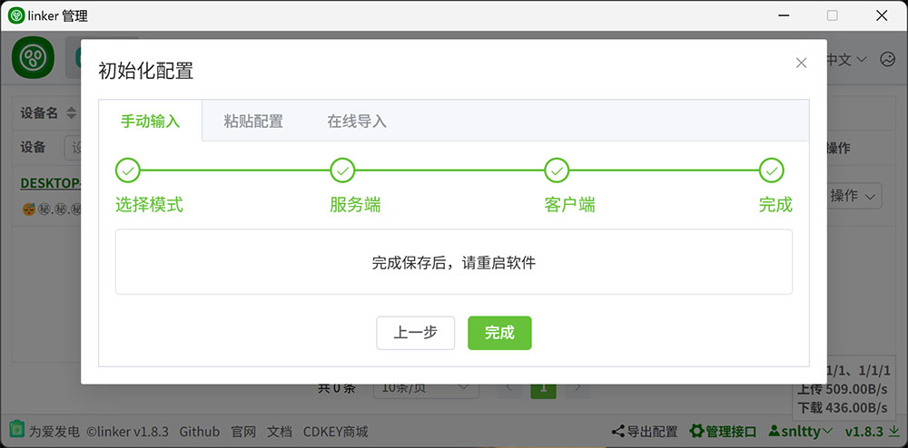

# 2.8、初始化配置3（客户端）


## 1、客户端使用web初始化

:::tip[说明]
1. 运行程序后,浏览器打开<a href="http://127.0.0.1:1804" target="_blank">http://127.0.0.1:1804</a>填写信息进行初始化
2. 只勾选客户端
3. 你可以勾选**我有服务器**，填写你部署的服务端的各种信息，默认使用公共服务器`linker.snltty.com:1802`
4. 有一点很重要，当多个客户端的`分组名、分组密码`均一致时，相互可见，同一服务器可以任意多分组，不同分组之间互不干扰




对应配置文件 client.json
```
{
    "Name": "A", //客户端名
    //顶级满权限
    "FullAccess": true,
    //按下标，1有权限，0无权限，可以看`src/linker.messenger.api/Config.cs`里的`AccessValue`枚举
    "AccessBits": "1111111111111111111111111111111111111111111111111111111111111111",
    //管理接口
    "CApi": {
        "ApiPassword": "snltty", //api密码
        "WebPort": 1804, //web端口
        "WebRoot": "./web/" //web根目录
    },
    //cdkey
    "Cdkey": {
        "SecretKey": "snltty"
    },
    //服务器
    "Servers": [
        {
            "Name": "Linker", //信标服务器名称
            "Host": "127.0.0.1:1802", //信标服务器地址
            "SecretKey": null, //信标密钥
            "UserId": "8225e9d4-0ac7-4d76-9946-c4fe04ad4696" //用户标识，多个客户端可相同
        }
    ],
    //分组
    "Groups": [
        {
            "Name": "snltty", //分组名
            "Id": "snltty", //分组id
            "Password": "snltty" //分组密码
        }
    ],
    //中继
    "Relay": {
        "Servers": [
            {
                "SecretKey": "snltty", //中继密钥
                "Disabled": false, //是否禁用
                "SSL": true //启用ssl
            }
        ]
    },
    //内网穿透
    "SForward": {
        "SecretKey": "snltty" //服务器穿透密钥
    },
    //更新
    "Updater": {
        "SecretKey": "snltty" //更新密钥
    },
    //自定义验证
    "Action": {
        "Args": {} //自定义验证的参数
    }
}
```
:::


